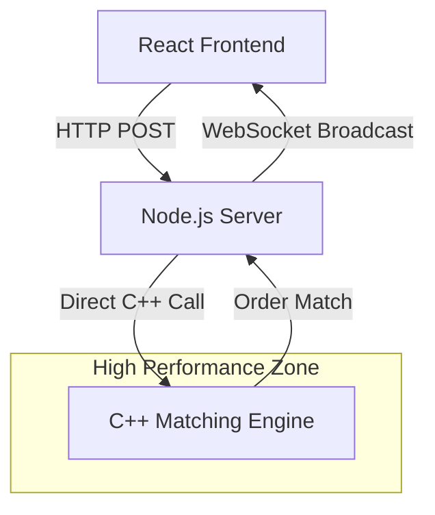

# Proxima: Ultra-Low Latency Limit Order Book

**Note:** This README was generated with the help of AI — please don't judge me for that 😄

**Proxima** is a high-frequency trading (HFT) engine built to demonstrate the power of hybrid architecture. It combines the raw performance of **C++** for order matching with the flexibility of **Node.js** and **React** for real-time visualization.


---

## 🚀 Key Features

- **High-Performance Core:** A custom C++ matching engine capable of processing **80,000+ orders per second** (benchmarked on local hardware).
- **Hybrid Architecture:** Uses **Node.js N-API (node-addon-api)** to bridge C++ and JavaScript, eliminating the overhead of JSON serialization/deserialization.
- **Real-Time Data:** Broadcasts Level 2 Market Data (L2) via **WebSockets** to a React frontend with <50ms latency.
- **Order Types:** Supports both **Limit Orders** (Maker) and **Market Orders** (Taker).
- **Visual Dashboard:** A dark-mode trading terminal enabling instant visualization of the Orderbook, Spread, and Trade History.

---

## 🛠️ Tech Stack

- **Core Engine:** C++20 (STL Containers, Smart Pointers)
- **Backend:** Node.js, Express, WebSocket (`ws`), N-API (`node-addon-api`)
- **Build System:** CMake, `cmake-js`
- **Frontend:** React, Vite, CSS Modules

---

## 🏗️ Architecture

The system uses a **Zero-Copy** approach where possible to minimize latency:



---

## ⚡ Performance Benchmark

To verify the engine's throughput, a dedicated benchmark script simulates high-frequency trading traffic.

### Results on Local Machine

```bash
✅ DONE!
⏱️  Time taken: 2.5252 seconds
⚡ Performance: 79,200 orders/second
```

### Run the benchmark yourself

```bash
node benchmark.js
```

---

## 📦 Getting Started

### Prerequisites

- Node.js (v16+)
- CMake
- C++ Compiler (g++, clang, or MSVC)

---

### 1️⃣ Installation (Backend & Core)

```bash
# Clone the repository
git clone https://github.com/GuitarHero-28/proxima.git
cd proxima

# Install backend dependencies
npm install

# Compile the C++ Addon (This builds the 'proxima.node' file)
cmake-js compile
```

---

### 2️⃣ Installation (Frontend)

```bash
cd frontend
npm install
```

---

## 🖥️ Running the Application

You need to run the Backend and Frontend in separate terminals.

### Terminal 1: Backend

```bash
# Starts the Node.js server + C++ Engine
node server.js
```

Server runs at: http://localhost:3000

---

### Terminal 2: Frontend

```bash
cd frontend
npm run dev
```

Dashboard launches at: http://localhost:5173

---

## 🔮 Future Roadmap

- [ ] Implement Object Pools (Arena Allocation) to further reduce memory fragmentation in C++.
- [ ] Add Market Maker bots to simulate realistic liquidity.
- [ ] Deploy using Docker containers for easier scaling.

---

